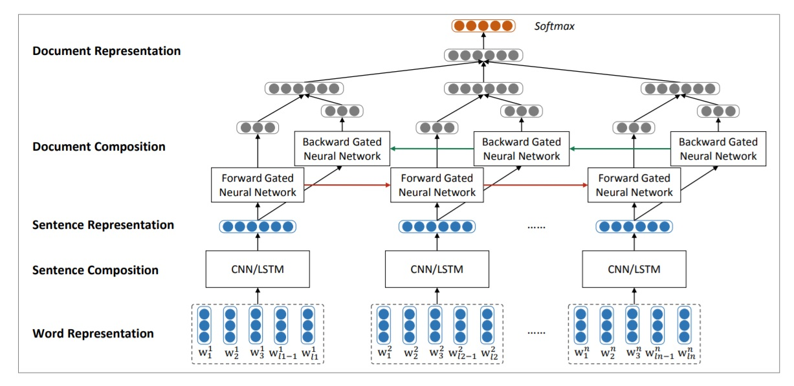

# Studying Party Differences in Opinion Writing on the Supreme Court
- Alyssa Eisenberg and Seung Ham
- August, 2018

In this project, we try to find political party difference in opinion on the Supreme Court. We used https://www.courtlistener.com/api/bulk-data to download ~22,000 opinion texts from 1792 to 2018 which have political party of author at the time of writing available.

## Getting Data:
1. In **data** folder, run ``. data_download.sh`` which will download all the necessary data.
2. Run ``python data_process.py`` which will create **data.p** file containing both party information and tokenized opinion texts.
3. In EDA.ipynb, there is a line of code saving vocabulary class to **vocab.p** file which can be used later for modeling (i.e. Baseline.ipynb).

## Preprocessing Data
### Sentence Tokenization
Most of text data was available in HTML format, so we first converted it into normal text using lxml.html package. After that, we used NLTK sentence tokenizer to separate each opinion document into sentences. Since there were many sentences with numberings and titles in these legal documents, we used NLTK tagger to filter only those sentences with both noun/pronoun and verb included.

### Word Tokenization
Once we get the set of sentences to use, we tokenized them into words based on the vocabulary used in Google pre-trained word2vec (https://code.google.com/archive/p/word2vec/). As part of this process, we removed all punctuations from sentences and labeled unknown words as '<unk>'.
  
## Baseline Model
For the baseline model, we used logistic regression with TF-IDF matrix as features. For TF-IDF, we used top 1000 words as stop words. The model results were surprisingly good, and we didn't have to tune many hyperparameters for the model. In terms of cross-validation, we used 80/10/10 split for train/dev/test data.

## Neural Net Model
To see if we can improve the model performance, we followed the methods described in the paper by Tang, Qin, and Liu (http://aclweb.org/anthology/D15-1167), and the model has the below structure:
        
1. Word vectors using word2vec
2. Different filters for CNN with different widths.
   For each filter, there are:
    - Linear layer
    - Average pooling
    - tanh transformation
3. Average of outputs from three filters to find the sentence representation.
4. Input the CNN sentence representations to the bi-directional gated RNN.
5. Outputs from forward RNN and backward RNN are concatenated for each sentence,
   and the concatenated vectors are averaged to give the document representation.
6. Input the document representation to softmax layer.

Below is the model structure diagram from the paper.

Detailed model parameters used can be found in [NN.ipynb](NN.ipynb) file. Model performance was actually worse than the baseline model. One reason might be due to sentence and word limits in the nueral net model. To train both CNN and RNN efficiently, we had to limit number of sentences per doc to 200 and number of words per sentence to 100, and this might have caused key words lost which might have been identified by TF-IDF matrix.

## Model Evaluation
### Word Attribution
On top of building prediction model, we wanted to understand what words contribute most to each party. For the baseline model, we looked at magnitude of coefficients of logisitc regression. Some of top 10 words for each party were judge names corresponding to each party which was not surprising. For the neural net model, we tried to use LIME method, but since there was no function readily available for our model structure and due to limited time, we couldn't really look at which words contribute the most to political party.

### Cross-entropy Comaprison
For both baseline and neural network models, we divided train dataset into 10 time periods of equal length and calculated cross-entropy loss for each period to see if there was any trend over time. Higher cross-entropy loss means less party difference in opinion texts, and both models show similar trends over time.

## Final Note
If we had more time, we could spend a bit more time on tuning hyperparameters for the neural net model. Since the model was very complex, it took long time to train the model, and it would be great if we could opitimze it more. Also, as discussed above, it would be great to use LIME method to find out whether the model is actually working real.

More detailed project report can be found <a href="https://www.overleaf.com/18030683ttmhjwjsvysx#/68288176/" target="_blank">here</a>

## References:
1. CourtListener from Free Law Project. https://www.courtlistener.com/api/bulk-info/
2. Tang, Duyu; Qin, Bing; Liu, Ting. “Document Modeling with Gated Recurrent Neural Network for Sentiment Classification.” Proceedings of the 2015 Conference on Empirical Methods in Natural Language Processing (2015): 1422-1432. Retrieved June 17 2018 from http://aclweb.org/anthology/D15-1167
